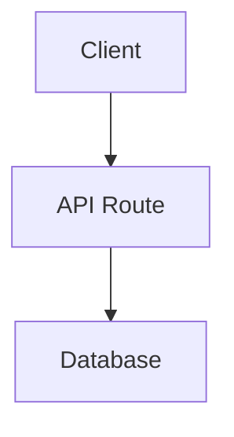

# System Architecture

## System Overview
*[Placeholder: High-level explanation of the system and its core components.]*

## Planned Architecture
*[Placeholder: Detailed breakdown of the architecture, data flow, and services.]*

## Architecture Diagram

## Frontend Flow
*[Placeholder: Description of how the frontend components interact and manage state.]*

## Backend Flow
*[Placeholder: Description of API routes, external integrations, and data processing.]*

## Scalability Notes
*[Placeholder: Thoughts on how the system can scale as user base grows.]*
